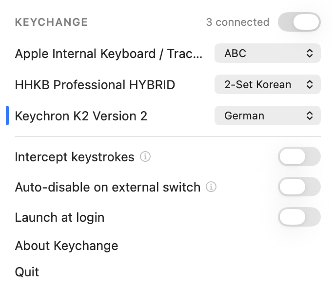

# Keychange

**Switches the macOS input source per keyboard.** Assign a layout to each of your keyboards once —
German on the internal one, ABC on the mechanical, Korean on the one by the window — and Keychange
switches the system input source as soon as you start typing on that device.

<p align="center">
  
</p>

macOS switches input sources per app, or when you press a shortcut — never per keyboard. If you own
more than one keyboard with different layouts, you end up switching by hand every time you move your
hands. Keychange is a small menu bar app that does it for you.

## Install

Download the latest build from [Releases](../../releases), move `Keychange.app` to
`/Applications`, and launch it.

Builds are not notarized yet, so the first launch needs a right-click → **Open** (or
System Settings → Privacy & Security → **Open Anyway**).

## Permissions

**Input Monitoring** is required — it is the only way to know *which* keyboard a keystroke came
from. Keychange asks for it from the popover's "Allow Input Monitoring…" button, never at startup,
and macOS applies the grant after the next launch. Keystrokes are only ever inspected for their
source device; nothing is recorded, stored, or sent anywhere.

**Accessibility** is optional and only needed for "Intercept keystrokes" (see below).

## Using it

The menu bar shows the active input source as a small badge, which animates when the source changes.
Click it for the list of connected keyboards; each gets a dropdown with your enabled input sources,
plus **Don't switch** for keyboards Keychange should leave alone. Mappings are saved per device and
survive unplugging.

The switch in the header disables switching entirely without losing your mappings. Option-clicking
the menu bar icon reveals each device's vendor and product ID — useful when two keyboards have
similar names.

| Setting | What it does |
|---|---|
| **Intercept keystrokes** | Fixes the *first* character after a switch, which otherwise still uses the previous layout. Requires Accessibility, and puts Keychange in the path of every key press — off by default. |
| **Auto-disable on external switch** | If you change the input source yourself, Keychange turns itself off instead of switching back while you type. Re-enable it from the popover. |
| **Launch at login** | Registers the app with macOS via `SMAppService`. |

## How it works

An `IOHIDManager` watches keyboard devices and reports which one produced each key event; a device
change looks up that keyboard's mapping and calls `TISSelectInputSource`. Because the keystroke and
the switch race each other, the first character normally still belongs to the old layout — that is
what "Intercept keystrokes" fixes, using a `CGEventTap` that re-translates the character with the
target layout (`UCKeyTranslate`), or briefly withholds the key press when switching to an input
method like Korean, which composes from key codes at delivery time.

## Building

Requires Xcode 16+ and macOS 14 or later.

```sh
git clone https://github.com/dennistimmermann/keychange.git
cd keychange
xcodebuild -project Keychange.xcodeproj -scheme Keychange -configuration Release build
```

Device identification inside the event tap uses two private symbols (`CGEventCopyIOHIDEvent`,
`IOHIDEventGetSenderID`), resolved at runtime and compiled in only when the
`KEYCHANGE_PRIVATE_HID` flag is set. Build with `SWIFT_ACTIVE_COMPILATION_CONDITIONS=""` for a
binary that contains no trace of them; the app then identifies devices via the HID stream instead.

Tagging a commit `vX.Y.Z` and pushing the tag builds that version and attaches it to a GitHub
release.

## Credits

Inspired by [autokbisw](https://github.com/ohueter/autokbisw) by @ohueter, a command-line tool that
solves the same problem. Keychange is an independent implementation with a UI.

[MIT](LICENSE) © 2026 Dennis Timmermann
