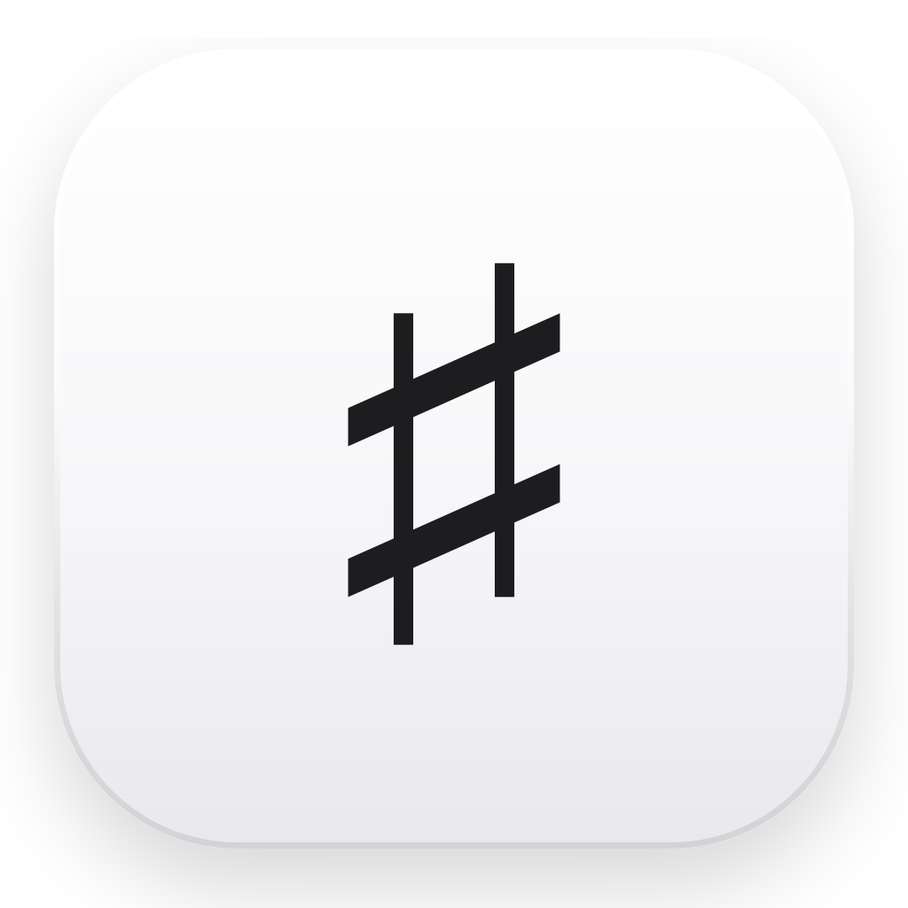
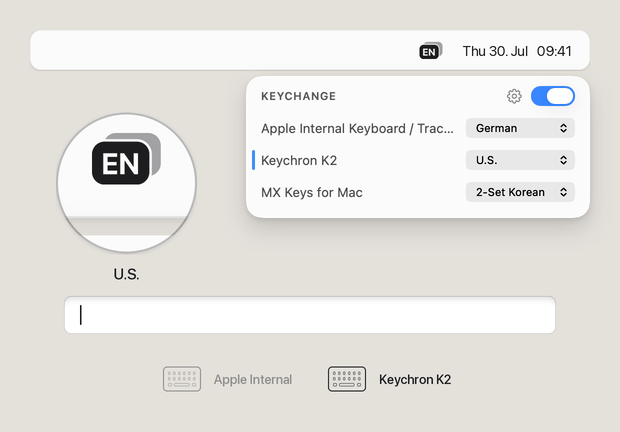

<p align="center">
  
</p>

<h1 align="center">Keychange</h1>

<p align="center">
  <b>The right keyboard layout for every keyboard.</b><br>
  A macOS menu bar app that switches the input source automatically when you switch keyboards.
</p>

<p align="center">
  <a href="https://keychange.dev">Website</a> ·
  <a href="https://github.com/dennistimmermann/keychange/releases/latest">Download</a>
</p>

<p align="center">
  
</p>

macOS can switch input sources per app or with a shortcut — but never per keyboard. If your
keyboards have different layouts, you end up switching by hand every time you move between them.
Keychange does it for you: assign a layout to each keyboard once, and it switches the moment you
start typing on that device. Inspired by [autokbisw](https://github.com/ohueter/autokbisw).

## Features

- **Automatic switching** — the input source follows whichever keyboard you type on
- **Per-keyboard mappings** — pick a layout for each keyboard, or tell Keychange to leave one alone
- **Menu bar badge** — always see the active input source at a glance
- **Remembers your keyboards** — mappings survive unplugging and reconnecting
- **Private by design** — keystrokes are only checked for which device they came from; nothing is recorded or sent anywhere

## Install

Download [Keychange.dmg](https://github.com/dennistimmermann/keychange/releases/latest/download/Keychange.dmg),
drag `Keychange.app` into `/Applications`, and launch it.

Or with Homebrew:

```sh
brew tap dennistimmermann/tap
brew install --cask keychange
```

Keychange will ask for **Input Monitoring** permission — that's how macOS lets it see which keyboard
a keystroke came from, and it's the only way to do this.

## Using it

Click the menu bar icon to see your connected keyboards. Each one gets a dropdown with your input
sources, plus **Don't switch** for keyboards Keychange should ignore. The switch in the header
disables Keychange.

Tip: option-click the menu bar icon to see each keyboard's vendor and product ID — handy when two
keyboards have similar names.

### Settings

| Setting | What it does |
|---|---|
| **Switch layout** | When the switch lands. **After key press**: the character you typed to get there still uses the old layout. **Before key press**: Keychange intercepts the press and fixes that character — every key press in every app except password fields passes through it. Needs the Accessibility permission. |
| **On external layout change** | What happens when you change the input source yourself. **Disable**: Keychange turns off until you turn it back on. **Pause**: turns off, then resumes by itself once the input source matches your keyboard again. **Ignore**: your choice stays until you switch keyboards. **Reset**: your choice stays until the next key press. |
| **Check for updates automatically** | Looks for new releases on GitHub and offers to install them. This check is the only network request the app makes. |
| **Launch at login** | Starts Keychange when you log in. |

## Building

Requires Xcode 26 and macOS 14 or later.

```sh
git clone https://github.com/dennistimmermann/keychange.git
cd keychange
xcodebuild -project Keychange.xcodeproj -scheme Keychange -configuration Release build
```

An `IOHIDManager` watches keyboard devices and reports which one produced each key event; a device
change looks up that keyboard's mapping and calls `TISSelectInputSource`. Because the keystroke and
the switch race each other, the first character normally still belongs to the old layout — that is
what "Switch layout → Before key press" fixes, using a `CGEventTap` that re-translates the character with the
target layout (`UCKeyTranslate`), or briefly withholds the key press when switching to an input
method that composes from key codes at delivery time.

Tagging a commit `vX.Y.Z` and pushing the tag builds that version and attaches it to a GitHub
release.

## Support

Keychange is free and stays free. If it saved you some friction, you can leave a tip on
[Ko-fi](https://ko-fi.com/tmrmn) or sponsor me on
[GitHub](https://github.com/sponsors/dennistimmermann).

## Credits

Inspired by [autokbisw](https://github.com/ohueter/autokbisw) by @ohueter and @jeantil, a
command-line tool that solves the same problem.

Automatic updates are powered by [Sparkle](https://github.com/sparkle-project/Sparkle), MIT licensed.

[MIT](LICENSE) © 2026 Dennis Timmermann
